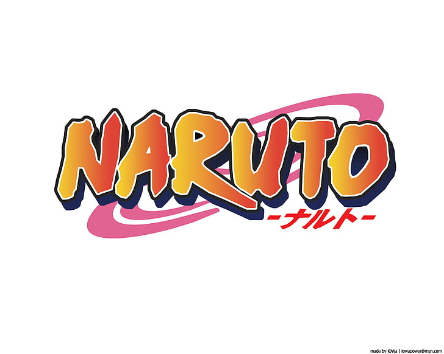
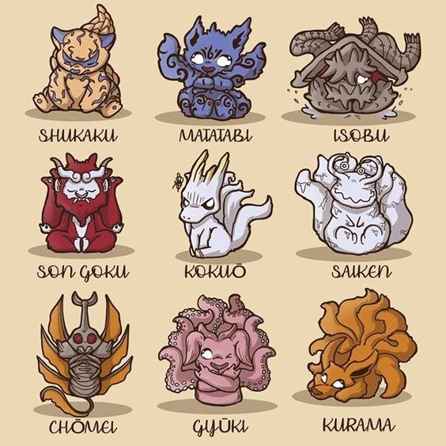
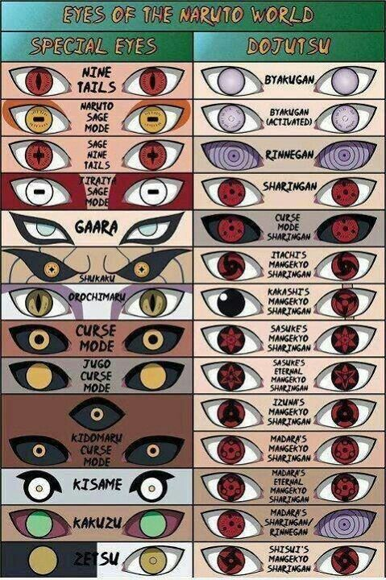
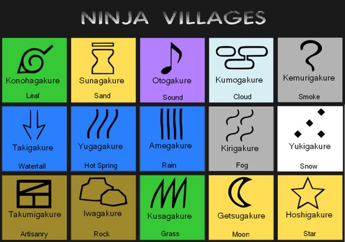
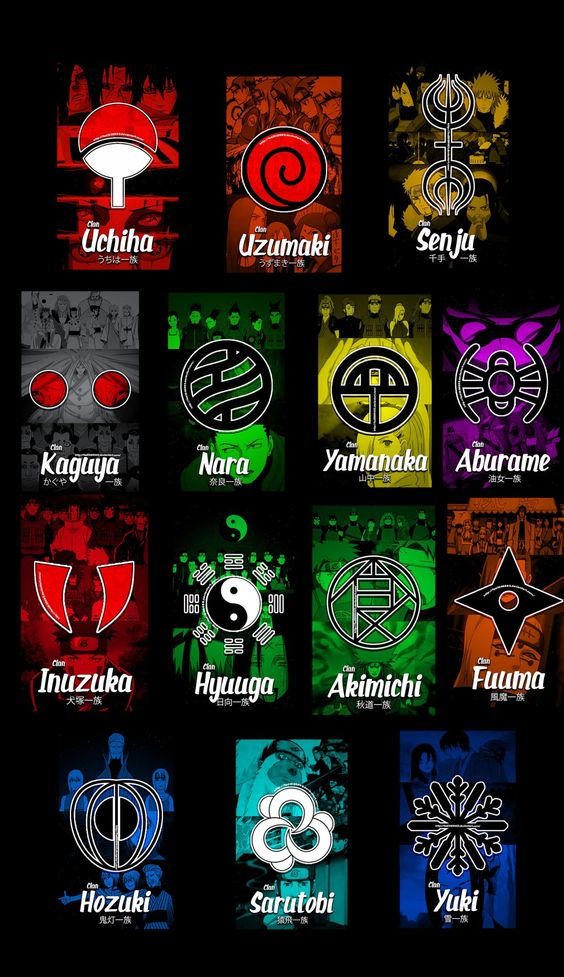

# Anime Series: Naruto

## Story all About?
### Naruto is a Japanese manga series written and illustrated by Masashi Kishimoto. It tells the story of Naruto Uzumaki, a young ninja who seeks recognition from his peers and dreams of becoming the Hokage, the leader of his village. The story is told in two parts: the first is set in Naruto's pre-teen years (volumes 1–27), and the second in his teens (volumes 28–72). The series is based on two one-shot manga by Kishimoto: Karakuri (1995), which earned Kishimoto an honorable mention in Shueisha's monthly Hop Step Award the following year, and Naruto (1997).

## Characters 
| Characters | Info |
|------------|------|
|Naruto Uzumaki| Naruto is a natural prankster and troublemaker.|
|Sasuke Uchiha | Sasuke Uchiha is Naruto's rival and best friend.|
|Sasuke Uchiha| Sakura is a member of Team 7.|
|Kakashi Hatake| Kakashi Hatake is the easygoing, smart leader of team 7.|
|Hinata Hyuga|Hinata Hyuga is a member of Team 8 who suffers from a lack of self-confidence.|
|Kiba Inuzuka| Kiba Inuzukais a member of Team 8 from the Inuzuka Clan.|
|Akamaru| Akamaru is Kiba Inuzuka's ninja dog, best friend, and constant companion.|
|Shino Aburame| Shino Aburame is a member of Team 8 from the Aburame Clan.|
|Kurenai Yuhi| Kurenai Yuhi is the leader of Team 8.|
|Shikamaru Nara| Shikamaru Nara is a member of Team 10.|
|Ino Yamanaka| Ino Yamanaka is a member of Team 10 and Yamanaka Clan.|
|Choji Akimichi | Choji Akimichi is a member of Team 10, typified by his affinity for food.|
|Asuma Sarutobi| Asuma Sarutobi was the leader of Team 10.|
|Rock Lee| Rock Lee is a member of Team Guy and the favorite student of team leader Might Guy.|
|Neji Hyuga|Neji Hyuga was a member of Team Guy and a child prodigy of the Hyuga clan.|
|Tenten| Tenten is a member of Team Guy.|
|Might Guy| Might Guy is the leader of Team Guy who dedicates most of his time to his pupil Rock Lee.|

# Naruto (Logo in the title of the series)
 
    
## Tailed Beast

## The tailed beasts are a group of nine gigantic beings made of incomparable amounts of chakra, the source of power in Naruto. Originally, they were part of an even larger creature known as the Ten-Tails until the legendary Sage of Six Paths divided the being's chakra into nine separate, sentient creatures. Thus, the tailed beasts were born. Each of them is differentiated by the number of tails that they possess, ranging from one to nine. In addition to their differing tail numbers, each tailed beast also has a distinct design inspired by different animals and mythical creatures. But despite their bestial appearance, the tailed beasts are intelligent and capable of conversing with humans and one another through telepathy. Here are the nine-tailed beast in naruto series:

## Tailed-Beast: 
1. Shukaku (One Tailed-Beast): Shukaku can combine wind and earth elements to use Magnet Release, and is the only tailed beast which can use cursed seals from its markings and infuse them into the Rasengan to create the Sage Art: Magnet Release Rasengan, which was powerful enough to restrain Madara Uchiha's shadow when he was the Ten-Tails
2. Matatabi (Two Tailed-Beast): Matatabi has the power to create and manipulate fire. It can even produce a massive fire ball explosion that can destroy an entire building as seen in its battle against Hidan and Kakuzu. Her jinchuuriki, Yugito Nii posses most of the powers of Matatabi.
3. Isobu (Three-Tailed-Beast): Isobu is a large turtle creature with a crab-like shell and three tails reminiscent of shrimp. In addition to its ability to control water and generate immense tidal waves, Isobu is also able to retreat to a pocket dimension at will. Its host before the leader of the Hidden Mist was Rin, one of Kakashi Hatake's teammates who sacrificed herself to prevent Isobu from being released in the Hidden Leaf.
4. Son Goku (Four-Tailed-Beast): Son Gokū is a gigantic red ape with demonic features and four powerful tails, capable of controlling lava and creating volcanoes. It was last sealed inside Rōshi of the Hidden Stone Village. The prideful beast is also one of the most vocal about its resentment at being referred to by its tails, instead preferring to be called by his proper name.
5. Kokūo (Five-Tailed Beast): Kokūo, the Five-Tails, has one of the more unconventional designs among the tailed beasts as a combination of a dolphin and a horse. Kokūo's horse-like body allows it to physically overpower many opponents. It is also able to superheat water to a boiling point and use that generated steam to further empower itself. Like Son Gokū, Kokūo was last sealed inside a ninja from the Hidden Stone Village.
6. Saiken (Six-Tailed Beast): The Six-Tails, taking the form of a gigantic bipedal slug with two stubby legs and six oozing tails. Like an actual slug, Saiken is capable of secreting a sticky substance, which it uses to trap its opponents. Saiken's most recent jinchuriki was Utakata of the Hidden Mist Village.
7. Chōmei (Seven-Tailed Beast): Unique among the tailed beasts is Chōmei, who takes on the appearance of a monstrous rhinoceros beetle with six large wings, with its abdomen counting as its seventh tail. Chōmei is the only tailed beast capable of flight and is the only one not connected to a major ninja village, instead being sealed inside a ninja from the Hidden Waterfall Village, a much smaller ninja community compared to the bigger five.
8. Gyūki (Eight-Tailed Beast): Gyūki takes the form of a giant bull with the eight tails of an octopus. In theme with its octopus features, Gyūki can fire out blasts of ink and regenerate severed limbs.
9. Kurama (Nine-Tailed Beast): Kurama is the Nine-Tailed fox that was a catalyst for the entire series. One of Kurama's unique techniques is the ability to sense negative emotions, allowing it to discern the true intentions of those around it.
10. Ten-Tailed-Beast: The Ten-Tails, unlike the other tailed beasts, was a mindless being that served as an incarnation of the God Tree, the mythical origin of chakra in the ninja world. The Ten-Tails was more powerful than all the tailed beasts, having contained all of their collective power within one form. Resurrecting the Ten-Tails was the ultimate goal of the Akatsuki in their plan to control the world.

# Eyes in Naruto Series 
 

# Village in Naruto Series

# Clan in Naruto Series
 
